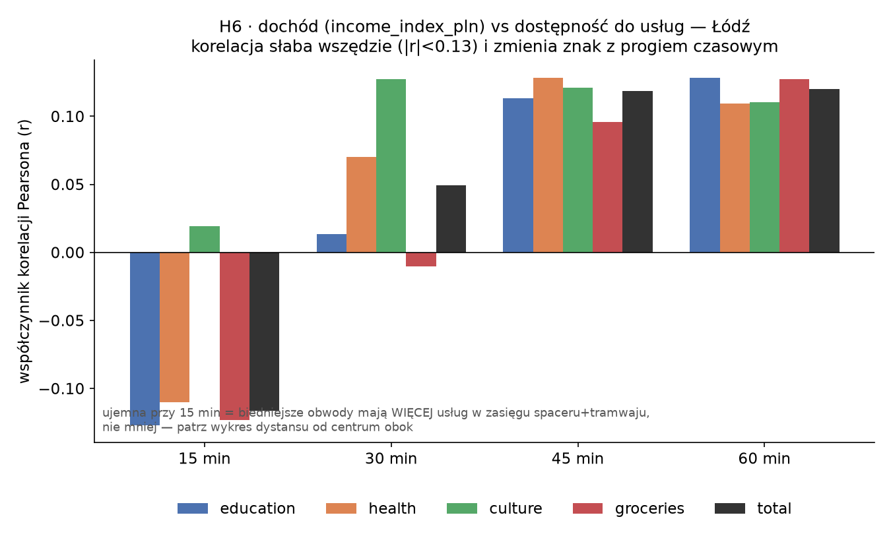
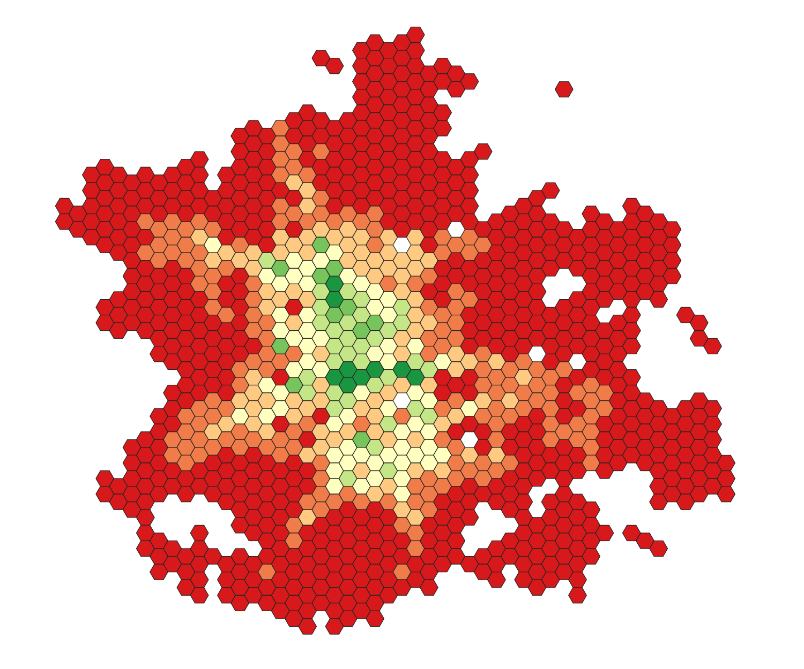
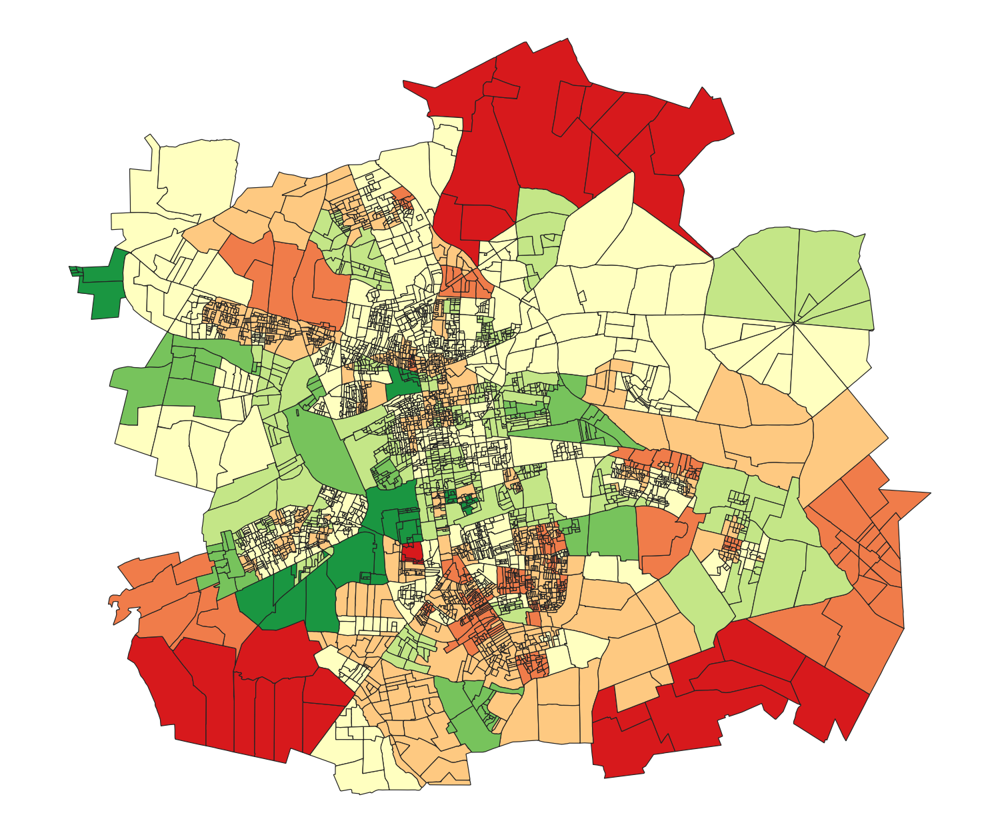
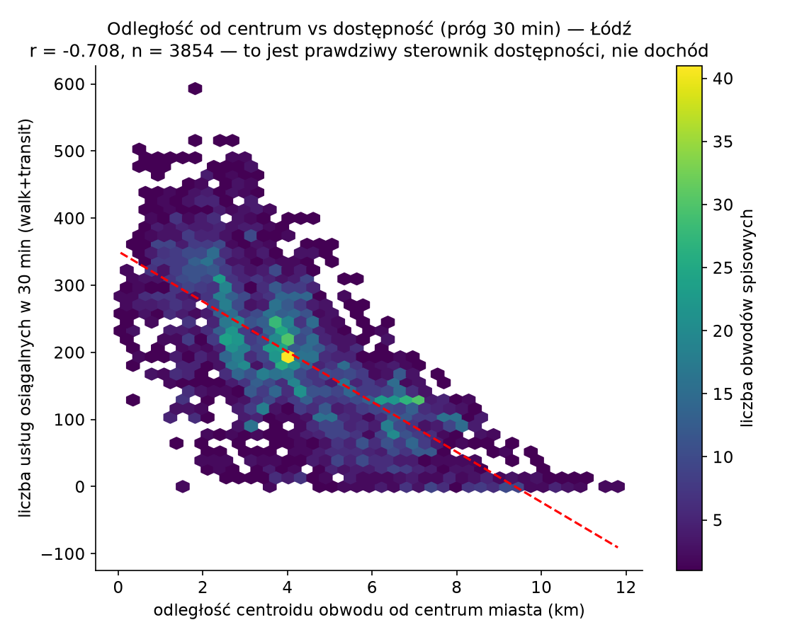

# Czy bieda oznacza gorszy dojazd? Dostępność transportowa a dochód w Łodzi

> **Uwaga: treść eksperymentalna.** Ten wpis w całości wygenerowała AI (Claude) na
> podstawie mojego kodu i danych — to wstępna, robocza wersja, która ma pomóc mi
> rozeznać się w temacie, nie ostateczne wnioski badawcze. Liczby i interpretacje
> traktuj jako punkt wyjścia do dalszej weryfikacji, nie jako gotowy wynik.

W [poprzednim wpisie](dochod-obwody-spisowe.md) opisałem, jak oszacować dochód mieszkańców
na poziomie obwodu spisowego, skoro polski spis go nie zbiera. Tu tę warstwę łączę
z pomiarem dostępności czasowej transportu publicznego w Łodzi i sprawdzam wprost
najbardziej oczywiste pytanie: **czy biedniejsze obwody mają gorszy dostęp do szkół,
przychodni, bibliotek i sklepów?**

Inspiracją, tak jak w poprzednim wpisie, jest artykuł Bragi, Loureiro i Pereiry (2026,
*Journal of Transport Geography*) o Fortalezie w Brazylii, gdzie odpowiedź brzmiała: tak,
wyraźnie. W Łodzi wyszło inaczej.

## Dane: nie rozkład jazdy, tylko to, co faktycznie jeździło

To zmienia interpretację wszystkiego, co dalej, więc mówię o tym od razu na starcie.
Do liczenia dostępności użyłem nie statycznego rozkładu GTFS, tylko
**zrealizowanego** rozkładu z `easy-GTFS-RT`: rekonstrukcji tego, co faktycznie jeździło
w Łodzi 21 sierpnia 2026, na podstawie nagranych pozycji pojazdów (Family A). Konkretnie
wariant p50, czyli medianę skorygowanego rozkładu na podstawie tego dnia (p85, wariant
bardziej pesymistyczny, też jest dostępny, ale nieużyty tutaj).

Reszta danych wejściowych: sieć drogowa i tramwajowa z OpenStreetMap, 1328 punktów usług
publicznych z Overpass API (szkoły i przedszkola, szpitale/przychodnie/apteki, biblioteki
i domy kultury, supermarkety), punkty startowe to centroidy 3854 obwodów spisowych z
poprzedniego wpisu. Silnik: [r5r](https://ipeagit.github.io/r5r/) (R, na bazie R5 z
Conveyal), tryb pieszo+transport publiczny, odjazd w oknie 07:00–09:00 (poranny szczyt),
progi 15/30/45/60 minut.

Jedna rzecz wymaga wyjaśnienia, bo brzmi alarmująco: r5r ostrzega, że „mniej niż 20%
serwisów w GTFS jeździ wybranego dnia". Sprawdziłem to i to nie błąd: ten konkretny feed ma
w jednym pliku 9 wariantów rozkładu skumulowanych na cały rok, ale tylko jeden (typowy
dzień powszedni, blisko 9900 kursów) jest aktywny wybranego dnia. Ostrzeżenie liczy
proporcję względem wszystkich 9, nie względem realnego ruchu tego dnia.

## Wynik: korelacja jest słaba i zmienia znak

Policzyłem korelację Pearsona między `income_index_pln` a liczbą usług osiągalnych w danym
progu czasowym, osobno dla każdej kategorii i progu (n=3854 obwodów):

| Próg | Edukacja | Zdrowie | Kultura | Sklepy | Razem |
|---|---:|---:|---:|---:|---:|
| 15 min | −0,128 | −0,110 | +0,019 | −0,123 | **−0,117** |
| 30 min | +0,013 | +0,070 | +0,127 | −0,010 | +0,049 |
| 60 min | +0,128 | +0,109 | +0,110 | +0,127 | +0,120 |

Przy krótkim progu (15 minut) kierunek jest **odwrotny** do naiwnej hipotezy: biedniejsze
obwody mają wtedy więcej usług w zasięgu, nie mniej. Przy dłuższym progu korelacja robi się
dodatnia, ale nadal słaba. Do tego udział samotnych matek w obwodzie (z poprzedniego wpisu)
koreluje z dostępnością **dodatnio** (r=+0,38 przy 30 minutach): tam, gdzie jest
więcej gospodarstw jednorodzicielskich, dostępność jest zwykle lepsza, nie gorsza.

## To, co naprawdę tłumaczy dostępność: odległość od centrum

Sprawdziłem alternatywne wyjaśnienie: odległość centroidu obwodu od centrum miasta.
Korelacja z dostępnością (razem, próg 30 minut) wyszła **r=−0,71**, czyli wielokrotnie
silniejsza niż z dochodem (r=+0,05 do +0,12, zależnie od progu). Mapy pokazują dokładnie to
samo wizualnie:

Dostępność maleje niemal promieniście od centrum, dochód nie ma takiego wzorca wcale.

**Wniosek: w Łodzi deprywacja transportowa jest przede wszystkim geograficzna, nie
ekonomiczna.** To ma sens, jeśli spojrzeć na strukturę miasta: Łódź to miasto
posocjalistyczne ze zwartym historycznym centrum, gdzie biedniejsze, gęściej zaludnione
dzielnice ze starą zabudową (i, zgodnie z poprzednim wpisem, więcej gospodarstw
jednorodzicielskich) leżą centralnie, właśnie tam, gdzie sieć tramwajowa jest najgęstsza.
To odwrotnie niż w typowym mieście zachodnim z peryferyjną biedą, i odwrotnie niż w
Fortalezie, gdzie efekt dochodowy był silny.

## Efekt MAUP: ta sama analiza na heksagonach

Obwody spisowe są mikroskopijne w centrum (gęsta zabudowa) i ogromne na granicy miasta.
To problem znany jako MAUP (modifiable areal unit problem) i już go zauważyłem w
poprzednim wpisie przy analizie przestrzennej struktury rodzinnej. Żeby sprawdzić, czy
tłumi sygnał, przeliczyłem tę samą analizę na jednolitej siatce heksagonów 500 metrów
(1479 komórek, granica miasta z dissolve obwodów spisowych).

Wynik przy 60 minutach: korelacja dochodu z dostępnością wzrosła z r=+0,12 (obwody) do
r=+0,28 (heksagony, n=646 z dopasowanym dochodem). Sygnał się **wzmocnił**, MAUP faktycznie
tłumił korelację, ale nawet po tej poprawce związek zostaje słaby do umiarkowanego, nie
silny. Główny wniosek się nie zmienia.

## Ilu mieszkańców Łodzi ma dostęp do usług

Osobna, prostsza metryka: nie „ile placówek widać z jednego miejsca", tylko „ilu
mieszkańców ma dostęp do choć jednej placówki danej kategorii". Liczona jako suma
populacji obwodów z co najmniej jedną placówką w zasięgu, podzielona przez populację
całego miasta:

| Kategoria | 15 min | 30 min | 45 min | 60 min |
|---|---:|---:|---:|---:|
| Edukacja | 90,7% | 97,7% | 99,6% | 99,8% |
| Zdrowie | 90,2% | 97,8% | 99,5% | 99,8% |
| Kultura | 75,0% | 95,7% | 99,0% | 99,8% |
| Sklepy | 86,4% | 97,3% | 99,5% | 99,8% |
| **Dowolna** | **94,0%** | **98,7%** | 99,7% | 99,8% |

Kultura wypada najsłabiej w krótkim progu: bibliotek i domów kultury jest po prostu mniej
niż szkół czy przychodni. Poza tym w porannym szczycie prawie każdy mieszkaniec Łodzi ma
w 30 minutach transportem publicznym i pieszo dostęp do co najmniej jednej placówki z
każdej kategorii.

## Ograniczenia

Wszystko to dotyczy jednego dnia (21 sierpnia 2026) i jednego okna czasowego (poranny
szczyt). Dostępność liczona jest z centroidu obwodu, więc dla dużych, peryferyjnych
obwodów to przybliżenie jest gorsze niż dla małych, gęstych obwodów centrum (stąd
heksagony jako sprawdzian). Liczba osiągalnych placówek to nie to samo co ich jakość:
jedna słabo wyposażona przychodnia liczy się tak samo jak dobrze wyposażona. I `income_
index_pln` niesie ze sobą wszystkie ograniczenia opisane w poprzednim wpisie: to
estymacja, nie zmierzony dochód.

## Dane i kod

Pełny pipeline (instalacja r5r, przygotowanie danych, wywołania, wykresy) jest opisany
krok po kroku w repozytorium
[easy-R5](https://github.com/GISBoost/easy-R5), folder `tools/accessibility_lodz/`
(`HANDOFF.md`, `RESEARCH_LOG.md`, `COLUMNS.md` z dokładnym znaczeniem każdej kolumny wyniku).

Kolejny wpis zawęża grupę docelową do studentów i sprawdza dostęp do uczelni, najpierw
w Łodzi, potem w sześciu miastach naraz. Tam wychodzi jeden z najbardziej zaskakujących
wyników całej tej serii.
