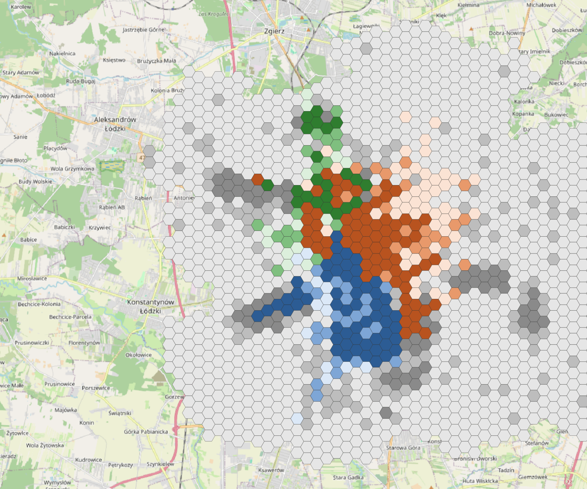
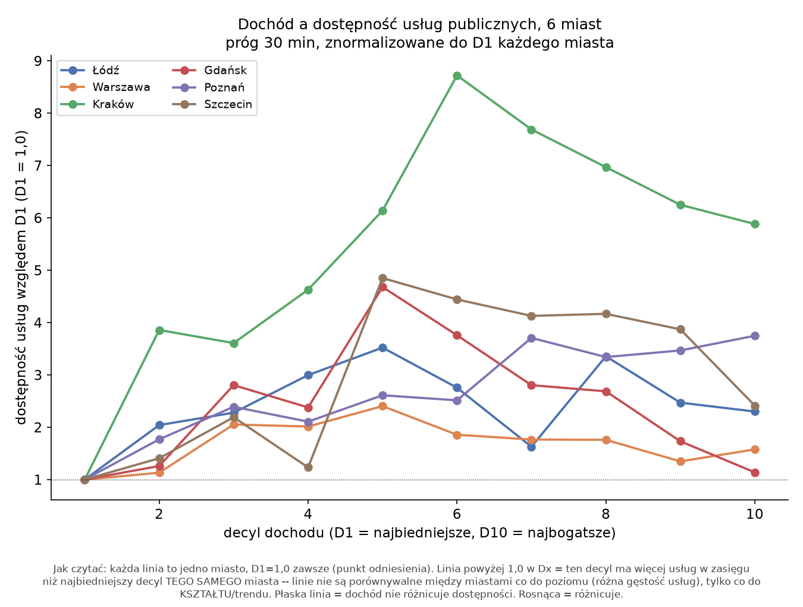
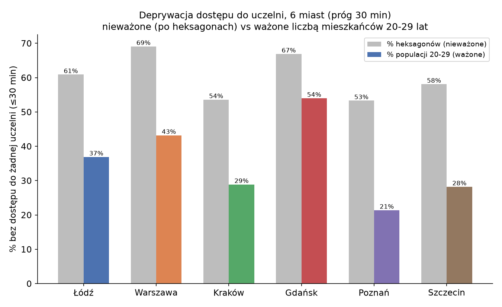

# 61% obszaru zamieszkanego przez studentów bez dostępu do uczelni w pół godziny: dostępność akademicka w 6 miastach

W [poprzednim wpisie](dostepnosc-dochod-lodz.md) sprawdziłem, że dostępność transportowa
w Łodzi zależy głównie od odległości od centrum, nie od dochodu. Tu zawężam pytanie do
konkretnej grupy i konkretnego celu: **studenci i uczelnie**. Zamiast całej populacji,
liczę dostępność dla mieszkańców w wieku 20-29 lat (proxy studentów z GUS NSP2021), a
zamiast usług publicznych, celem są budynki uczelniane. Najpierw w Łodzi, potem w pięciu
kolejnych miastach: Warszawie, Krakowie, Gdańsku, Poznaniu i Szczecinie.

Dochód świadomie pomijam na tym etapie: pytanie nie brzmi „kto ma pieniądze", tylko „ile
osób w ogóle da się tam dowieźć transportem publicznym w rozsądnym czasie".

## Dane: budynki uczelni z OpenStreetMap

Budynki akademickie pobrałem z Overpass API (tagi `amenity=university/college` i
`building=university`), sklasyfikowane regexem po nazwie na konkretne uczelnie. W Łodzi to
dało 47 budynków: Uniwersytet Łódzki (24), Politechnika Łódzka (14), Uniwersytet Medyczny
(9). W pozostałych pięciu miastach lista uczelni jest dopasowana do lokalnych realiów, bo
nie każde miasto ma osobną politechnikę czy uczelnię medyczną:

| Miasto | Uczelnia 1 | Uczelnia 2 | Uczelnia 3 |
|---|---|---|---|
| Łódź | Politechnika Łódzka | Uniwersytet Łódzki | Uniwersytet Medyczny |
| Warszawa | Politechnika Warszawska | Uniwersytet Warszawski | Warszawski UM |
| Kraków | Politechnika Krakowska | Uniwersytet Jagielloński | *(Collegium Medicum UJ: 0 trafień w OSM)* |
| Gdańsk | Politechnika Gdańska | Uniwersytet Gdański | Gdański UM |
| Poznań | Politechnika Poznańska | UAM | UM im. Marcinkowskiego |
| Szczecin | ZUT | Uniwersytet Szczeciński | Pomorski UM |

Sieć drogowa: wyciągi wojewódzkie z Geofabrik, przycięte do bboxa miasta (`osmosis`, z
obowiązkową flagą `completeWays=yes`, o czym więcej niżej). Zrealizowany GTFS z
`easy-GTFS-RT`, wariant p50. Jednostka przestrzenna: heksagony 500 metrów, tą samą metodą
co w poprzednim wpisie.

## Łódź: kto dojedzie, a kto nie

### Zmienność w ciągu dnia

Pierwsze pytanie: jak bardzo dostępność do uczelni waha się w zależności od minuty
wyjścia z domu. Policzyłem to na oknie 06:00–22:00 z pięcioma percentylami czasu przejazdu
(r5r pozwala na maksymalnie 5 na jedno wywołanie). Rozrzut bezwzględny (najlepsze 5% minut
kontra najgorsze 5%) wynosi średnio 12,4 budynku i jest **większy** w centrum, po prostu
dlatego że tam jest z czego spadać. Rozrzut względny jest odrobinę większy na peryferiach
(r=+0,16 z odległością od centrum), zgodnie z intuicją: rzadsza siatka transportu tam
oznacza większe wahania.

### Niezawodność dzień do dnia: dobry dzień kontra zły dzień

Druga metoda replikuje wprost podejście Bragi i in. (2026): porównanie dostępności na
typowym dniu (p50) z dostępnością na dniu gorszym (p85, 85. percentyl zrekonstruowanego
rozkładu). Różnica między nimi to wpływ niezawodności transportu, nie samej jego
gęstości.

Wynik dla Łodzi: zły dzień obniża dostępność średnio o 32,7% (mediana −18,8%), i to
peryferie tracą więcej niż centrum (r=−0,28 z odległością). Kierunek jest ten sam co w
Fortalezie, tylko efekt jest wyraźnie słabszy, co pasuje do innej struktury miasta: Łódź ma
biednych mieszkańców głównie centralnie, Fortaleza na peryferiach (patrz poprzedni wpis).
To, że kierunek efektu (peryferie tracą więcej na niezawodności) powtarza się mimo
odwróconej struktury dochodowej dwóch miast, sugeruje, że sam mechanizm niezawodności
zależy od gęstości sieci transportowej, nie od tego, gdzie akurat mieszkają biedniejsi
mieszkańcy.

### Mapa: która uczelnia jest najbliżej i dla kogo

Mapa łączy dwie zmienne naraz: kolor (niebieski = Politechnika Łódzka, pomarańcz =
Uniwersytet Łódzki, zielony = Uniwersytet Medyczny) pokazuje, która uczelnia dominuje
w danym heksagonie (ma najwięcej budynków osiągalnych w 30 minutach), a odcień pokazuje
tercyl gęstości populacji 20-29 lat. Szary to brak dostępu do którejkolwiek z trzech uczelni.

Trzy strefy wpływu są przestrzennie wyraźnie rozdzielone: PŁ dominuje na
południu/południowym zachodzie (zgodnie z realną lokalizacją głównego kampusu), UŁ na
północ i północny wschód od centrum, UM w małym klastrze na północnym zachodzie. Nakładają
się słabo, więc student mieszkający w danej części miasta ma zwykle praktyczny dostęp
tylko do jednej z trzech uczelni, nie do wyboru.

**Najważniejsza liczba z tej mapy: 61% heksagonów z populacją studencką (390 z 640) nie ma
dostępu do żadnej z trzech uczelni w 30 minut.** Dla porównania: dostępność do
jakiejkolwiek usługi publicznej dla całej populacji (poprzedni wpis) wynosiła 98,7%
w tym samym progu. Dostępność do uczelni jest dużo bardziej przestrzennie ograniczona niż
dostępność do usług ogółem.

**[Zobacz interaktywną wersję tej mapy →](https://gisboost.github.io/mapy-analizy/uczelnie-dostepnosc/)**
— wszystkie sześć miast naraz, z przełącznikiem między dominującą uczelnią, liczbą
dostępnych uczelni i osobnym włączaniem/wyłączaniem każdej z nich.

## Sześć miast: czy to się powtarza

### Dochód znowu nie jest predyktorem

Ta sama korelacja dochodu z dostępnością do usług publicznych, co w poprzednim wpisie,
policzona teraz dla wszystkich sześciu miast (heksagony, próg 30 minut):

| Miasto | r |
|---|---:|
| Gdańsk | +0,018 |
| Warszawa | +0,042 |
| Łódź | +0,147 |
| Szczecin | +0,210 |
| Poznań | +0,225 |
| Kraków | +0,286 |

Wszystkie korelacje są dodatnie, nie ujemne, i słabe do umiarkowanych. Żadne z sześciu
miast nie pokazuje wzorca „biedny = gorszy dostęp" w sposób, który dawałby silną
korelację. Wniosek z pilotażu łódzkiego potwierdza się i uogólnia na wszystkie sześć miast:
odległość od centrum tłumaczy dostępność wielokrotnie lepiej niż dochód, w każdym z sześciu
sprawdzonych miast.

### Która uczelnia wypada najsłabiej

We wszystkich miastach poza Poznaniem uczelnia medyczna ma najmniej heksagonów, w których
dominuje (czyli najsłabszą przestrzenną dostępność). Prawdopodobne wyjaśnienie: uczelnie
medyczne w Polsce mają zwykle mniejsze, rozproszone kampusy przy szpitalach klinicznych, nie
jeden duży zwarty kampus jak politechniki czy uniwersytety ogólne. Mniej budynków w jednym
miejscu oznacza mniejszy obszar, z którego którykolwiek z nich widać w progu 30 minut.

### Ile osób naprawdę nie ma dostępu, i historia jednej korekty

Tu warto pokazać kuchnię, nie tylko wynik końcowy, bo w trakcie tej analizy znalazłem
(a właściwie: zlecony przeze mnie niezależny audyt znalazł) realny błąd, i to jest dobry
przykład na to, dlaczego warto weryfikować własne wyniki cudzym spojrzeniem.

Pierwsza wersja liczyła „% heksagonów bez dostępu do żadnej uczelni":

| Miasto | % heksagonów bez dostępu |
|---|---:|
| Poznań | 53,3% |
| Kraków | 53,6% |
| Szczecin | 58,1% |
| Łódź | 60,9% |
| Gdańsk | 66,9% |
| Warszawa | 69,1% |

Stolica wypadła najgorzej, mimo największej bezwzględnej liczby budynków uczelni (48,
najwięcej z sześciu miast). Wynik był na tyle nieintuicyjny, że zleciłem świeżemu agentowi,
bez wcześniejszego kontekstu tej analizy, żeby to zweryfikował od zera: przeczytał
dokumentację r5r, porównał ją z kodem, i sprawdził hipotezę, że wynik jest za wysoki, żeby
był prawdziwy.

Dwa fałszywe tropy: hipoteza, że zrealizowany GTFS (a nie statyczny rozkład) zawyża wynik,
odrzucona empirycznie: przeliczenie Łodzi na statycznym rozkładzie dało 61,2% zamiast 60,9%,
różnica w granicy szumu. Hipoteza o błędzie strefy czasowej w kodzie R, odrzucona po
sprawdzeniu dokumentacji r5r (pakiet celowo ignoruje strefę czasową obiektu R i używa
strefy sieci transportowej).

Prawdziwy błąd: skrypt orkiestrujący całe przeliczenie miał zahardkodowaną datę, która
okazała się być **sobotą**, nie dniem powszednim, dla pięciu z sześciu miast (tylko Łódź
była liczona poprawnie, na dniu powszednim, od początku). Po poprawieniu daty i ponownym
przeliczeniu wszystkich pięciu miast: zmiana rzędu 1-2 punktów procentowych (np. Warszawa
70,4% → 69,1%). Błąd był realny, ale nie był głównym powodem wysokiego wyniku, tak jak
podejrzewał audytujący agent.

Druga korekta, tym razem metodologiczna, nie techniczna: metryka liczona po heksagonach
traktuje jednakowo heksagon na peryferiach z jednym studentem i gęsty heksagon centrum
z pięciuset. To sztucznie zawyża wynik szumem z rzadko zaludnionych obszarów brzegowych.
Po zamianie na metrykę ważoną liczbą mieszkańców 20-29 lat:

| Miasto | % heksagonów (nieważone) | % populacji 20-29 (ważone) |
|---|---:|---:|
| Poznań | 53,3% | **21,4%** |
| Kraków | 53,6% | **28,9%** |
| Szczecin | 58,1% | **28,2%** |
| Łódź | 60,9% | **36,9%** |
| Warszawa | 69,1% | **43,2%** |
| Gdańsk | 66,9% | **54,0%** |

Realny obraz to 21-54% studentów bez dostępu do żadnej z 2-3 uczelni w 30 minut, nie
53-70% heksagonów. Nadal duży problem, ale wyraźnie mniej dramatyczny niż sugerowała
pierwsza wersja. Kolejność miast też się zmienia: po ważeniu populacją to Gdańsk, nie
Warszawa, wypada najgorzej, głównie dlatego że ma najmniej budynków uczelni ze wszystkich
sześciu miast (37) w połączeniu z konkretnym rozkładem gęstości zaludnienia.

## Ograniczenia

Populacja 20-29 lat jest dopasowana tylko do części heksagonów (point-in-polygon po
centroidzie obwodu, nie area-weighted overlay): od 35% w Warszawie do 48% w Krakowie.
Kraków ma faktycznie tylko dwie uczelnie w analizie, bo Collegium Medicum UJ nie jest
otagowane w OSM jako `university`/`college`. Warszawa nie została przeliczona po naprawie
błędu `completeWays` przy przycinaniu sieci OSM (patrz niżej), co daje marginalne ryzyko
niedokładności tuż przy granicy obszaru analizy. I wszystkie liczby z sześciu miast dotyczą
tylko poziomu dostępności w typowym porannym szczycie, bez metody A/C (niezawodność),
którą sprawdziłem tylko dla Łodzi.

Osobny gotcha techniczny, wart zapisania dla każdego, kto przycina dane OSM przez osmosis:
pierwsza próba przycięcia sieci do bboxa Krakowa (bez flagi `completeWays=yes`) wywaliła
budowę sieci w r5r (`NullPointerException` przy strefach parkingowych), bo zwykłe
`--bounding-box` obcina drogi na granicy, zostawiając wiszące referencje do węzłów spoza
wycinka. Nie zawsze crashuje: Warszawa i pierwsza próba dla Gdańska przeszły bez błędu,
zależnie od tego, czy akurat jakaś relacja przecina granicę bboxa. To błąd, który może się
nie ujawnić, dopóki nie trafi na odpowiednią kombinację danych.

## Dane i kod

Pełny pipeline dla Łodzi: repozytorium
[easy-OTP](https://github.com/GISBoost/easy-OTP), folder `tools/accessibility_lodz/`
(`STUDENTS_ANALYSIS.md`). Dla sześciu miast: folder `tools/accessibility_cities/`
(`MULTI_CITY_ANALYSIS.md` za wyniki, `HOWTO_MANUAL.md` za instrukcję odtworzenia całości od
zera, łącznie z zapytaniami Overpass i kodem R).

Interaktywna mapa (wszystkie 6 miast): [gisboost.github.io/mapy-analizy/uczelnie-dostepnosc](https://gisboost.github.io/mapy-analizy/uczelnie-dostepnosc/)
(kod: [github.com/GISBoost/mapy-analizy](https://github.com/GISBoost/mapy-analizy)).

To zamyka tę serię trzech wpisów, od dochodu, przez ogólną dostępność, po dostęp do
uczelni. Otwarte kierunki na później: dostępność do miejsc pracy zamiast usług publicznych
(wymaga REGON-u, na razie odłożone) i dokładniejsze dopasowanie dochodu do heksagonów.
