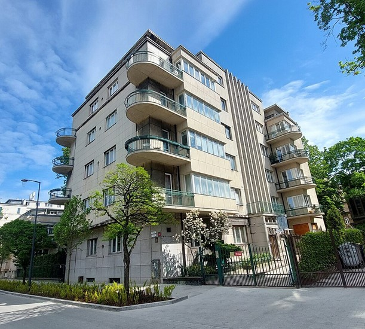
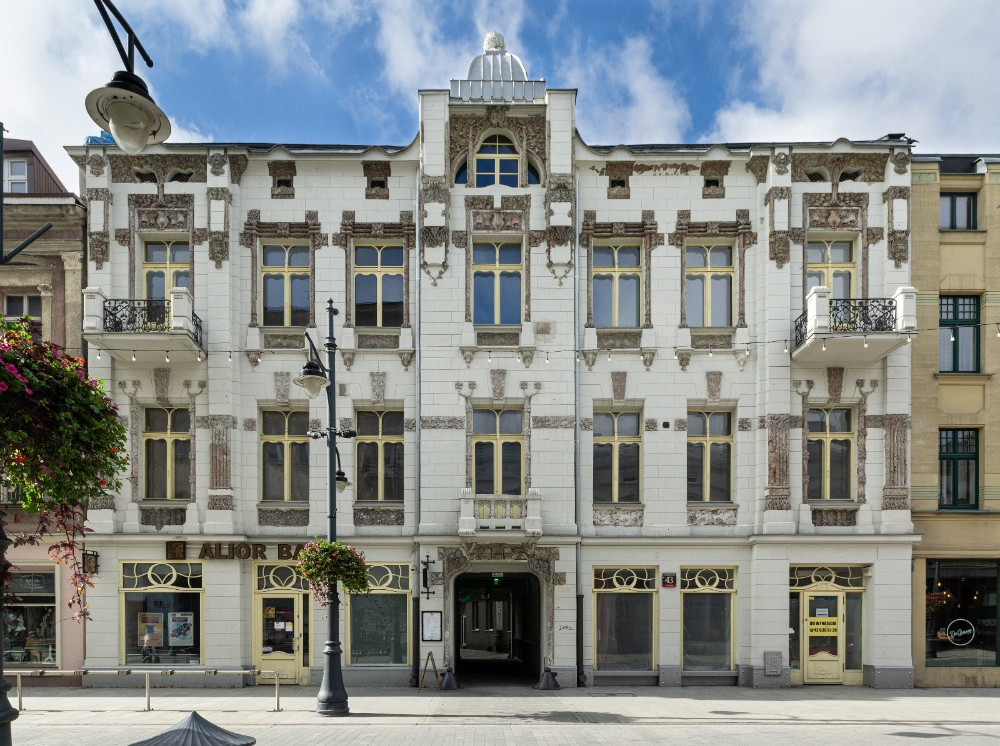

<head>
<meta name="google-site-verification" content="ih1W248cEBofov9EY3iEEdE6AS_Sftsy7er6eC52uxY" />
</head>

# Witaj na stronie GISBoost

Witaj na stronie projektu GISBoost. Moją misją jest zwiększanie świadomości o otaczającym nas środowisku oraz danych przestrzennych dostępnych publicznie oraz nieodpłatnie.

Wierzę, że edukacja nie powinna mieć barier. Dlatego stworzyłem przestrzeń, gdzie pasja do danych przestrzennych łączy się z ideą dzielenia się wiedzą. Poprzez darmowe materiały edukacyjne na YouTube oraz aktywną obecność w mediach społecznościowych, buduję most między zaawansowaną technologią a osobami, które dopiero rozpoczynają swoją przygodę z GIS.

Ten projekt wyrósł z przekonania, że zrozumienie przestrzeni, w której żyjemy, jest kluczem do podejmowania lepszych decyzji – zarówno w planowaniu miast, jak i w codziennym życiu. Dzieląc się swoim doświadczeniem w dziedzinie analiz przestrzennych, modelowania 3D i inżynierii, chcę inspirować innych do odkrywania możliwości, jakie dają nam nowoczesne narzędzia GIS.

Zapraszam Cię do eksploracji tego świata razem ze mną. Niezależnie od tego, czy jesteś początkującym entuzjastą GIS, studentem planowania przestrzennego, czy profesjonalistą szukającym nowych perspektyw – znajdziesz tu treści, które pomogą Ci rozwinąć skrzydła w świecie danych przestrzennych.

Strona ta służy również do promocji moich działań w internecie oraz mojej osoby. W sekcji [Projekty](projects.md) znajdziesz informacje o realizowanych przezemnie projekach oraz tego jakie umiejętności nabyłem i jakich narzędzi GIS używałem przy ich prowadzeniu. W zakładce [Poradniki](OpenTripPlanner.md) znajdują się informację jak można używać narzędzi GIS i tworzyć analizy przestrzenne.

# Konges Gra miejska 2025

